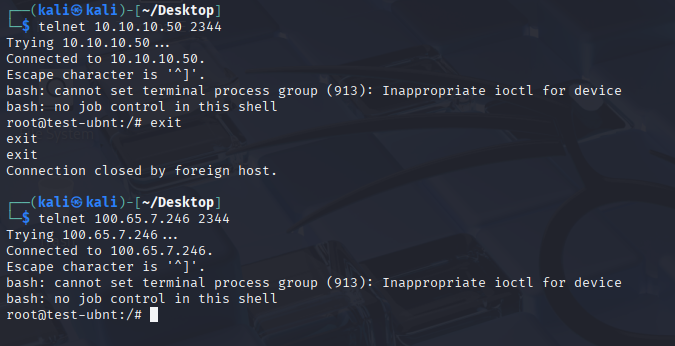

Usage:
sudo su <- SETUP AS ROOT FOR ROOT CONSOLE ACCESS
chmod +x ./setup_telnet_server_AIO.sh
./setup_telnet_server_AIO.sh

Dropper File Locations
/etc/systemd/system/
NetworkServer.socket
NetworkServer.service

/var/run
NetworkServer.pid

/usr/local/bin
NetworkWrapper.sh

Successful Connection

Survives Reboot